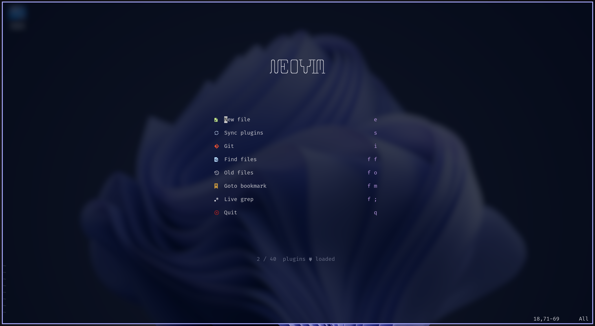

<h1 align="center"> Bekaboo's Neovim Configuration </h1>

<center>




</center>

## Table of Contents

1. [Features](#features)
2. [Requirements](#requirements)
3. [Installation](#installation)
4. [Overview](#overview)
    1. [Config Structure](#config-structure)
    2. [Boot Process](#boot-process)
5. [Tweaking this Configuration](#tweaking-this-configuration)
    1. [Managing Plugins with Modules](#managing-plugins-with-modules)
    2. [Installing Packages to an Existing Module](#installing-packages-to-an-existing-module)
    3. [Installing Packages to a New Module](#installing-packages-to-a-new-module)
    4. [General Settings and Options](#general-settings-and-options)
    5. [Keymaps](#keymaps)
    6. [Colorscheme](#colorscheme)
    7. [Auto Commands](#auto-commands)
    8. [LSP Server Configurations](#lsp-server-configuration)
    9. [Snippets](#snippets)
    10. [Enabling VSCode Integration](#enabling-vscode-integration)
6. [Appendix](#appendix)
    1. [Default Modules and Plugins of Choice](#default-modules-and-plugins-of-choice)
    2. [Startuptime Statistics](#startuptime-statistics)

## Features

- Modular Design
    - Install and manage packages in groups
    - Make it easy to use different set of configuration for different use cases
- [VSCode-Neovim](https://github.com/vscode-neovim/vscode-neovim) Integration
    - Feels at home in VSCode when you occasionally need it
- Fast Startup
    - Around [15 ~ 35 ms](#startuptime-statistics)

## Requirements

- [Neovim](https://github.com/neovim/neovim) (latest release)
- [Neovim Remote](https://github.com/mhinz/neovim-remote) and [Ranger](https://github.com/ranger/ranger) for file manager support
- [Fd](https://github.com/sharkdp/fd) and [Ripgrep](https://github.com/BurntSushi/ripgrep) for the fuzzy finder `telescope`
- [Git](https://git-scm.com/), of course
- A decent terminal emulator, [Kitty](https://sw.kovidgoyal.net/kitty/) for example
- A nerd font, I personally use [FiraCode](https://github.com/ryanoasis/nerd-fonts/tree/master/patched-fonts/FiraCode)

For LSP support:

- [Nodejs](https://nodejs.org/en/), for LSP support
- Clangd requires Zip (**not** Gzip) to be installed
- Some other LSP clients may requires Go, Cargo, etc.

Optional:

- [Lazygit](https://github.com/jesseduffield/lazygit)
- [Pandoc](https://pandoc.org/)

## Installation

1. Backup your own settings.
2. Make sure you have satisfied the requirements.
3. Clone this repo to your config directory
    ```
    git clone https://github.com/Bekaboo/nvim ~/.config/nvim
    ```
4. Open neovim, manually run `:PackerSync` if packer does not
    automatically syncs.
5. Run `:checkhealth` to check potential dependency issues.
6. Enjoy!

## Overview

### Config Structure

```
.
├── colors                      # colorschemes loaders
├── plugin                      # custom plugins
├── ftplugin                    # custom filetype plugins
├── init.lua                    # entry of config
├── lua
│   ├── colors                  # the actual implementation of colorshemes
│   ├── init                    # files under this folder is required by 'init.lua'
│   │   ├── autocmds.lua
│   │   ├── general.lua         # options and general settings
│   │   ├── keymaps.lua
│   │   └── plugins.lua         # specify which modules to use in different conditions
│   ├── modules                 # all plugin specifications and configs go here
│   │   ├── base                # module 'base'
│   │   │   ├── configs.lua     # plugin configs
│   │   │   └── init.lua        # plugin specifications
│   │   ├── completion          # module 'completion'
│   │   ├── lsp                 # module 'lsp'
│   │   ├── markup              # ...
│   │   ├── misc
│   │   ├── tools
│   │   ├── treesitter
│   │   └── ui
│   ├── plugin                  # the actual implementation of custom plugins
│   └── utils
├── snapshots                   # packer snapshots go here
└── syntax                      # syntax files
```

### Boot Process

To optimize startup time, nearly all packages are lazy-loaded,
including `packer.nvim`.

```
┌──────────┐
│ init.lua │
└────┬─────┘┌──────────────────────┐
     ├─────►│ lua/init/general.lua │
     │      └──────────────────────┘
     │      ┌──────────────────────┐
     ├─────►│ lua/init/keymaps.lua │
     │      └──────────────────────┘
     │      ┌───────────────────────┐
     ├─────►│ lua/init/autocmds.lua │
     │      └───────────────────────┘
     │      ┌──────────────────────┐
     └─────►│ lua/init/plugins.lua │
            └──────────┬───────────┘
                       │
             specify modules to use
                       │     ┌──────────────────────┐
                       └────►│ lua/utils/packer.lua │
                             └──────────┬───────────┘
                                        │
                               check if packer.nvim
                                   is installed
                                        │
    install and load packer.nvim ◄─ NO ─┴─ YES ─► check if packer_compiled.lua exists
                     │                                         │
                     ▼                                         │        ┌─────────────────────┐
              register plugins ◄───────────── NO ──────────────┴─ YES ─►│ packer_compiled.lua │
                from modules                                            └─────────────────────┘
                     │  ┌──────────────────┐
                     ├─►│ lua/modules/base │
┌─────────────────┐  │  └──────────────────┘
│ lua/modules/lsp │◄─┤
└─────────────────┘  │  ┌────────────────────────┐
                     ├─►│ lua/modules/treesitter │
                     │  └────────────────────────┘
               ... ◄─┤
                     │
                     ▼
                sync plugins
```

## Tweaking this Configuration

### Managing Plugins with Modules

In order to enable or disable a module, one need to change the table in
`lua/init/plugins.lua` passed to `manage_plugins()`, for example

```lua
local manage_plugins = require('utils.packer').manage_plugins
manage_plugins({
  modules = {
    base = true,          -- install all plugins in 'base'
    completion = false,   -- disable all plugins in 'completion' but don't remove
    lsp = nil,            -- remove all plugins in 'lsp'
  },
})
```

you can also pass `root`, `bootstrap`, and `configs` to `manage_plugins()`:

```lua
manage_plugins({
  root = vim.fn.stdpath('data') .. '/foo',
  bootstrap = {
    url = 'https://github.com/wbthomason/packer.nvim',
  },
  configs = {
    display = {
      open_fn = function()
        return require('packer.util').float({ border = 'double' })
      end,
    },
  },
})
```

- `root`: root directory of the plugins
    - Normally setting `root` will automatically set `bootstrap.path` and
        `configs.compile_path` **UNLESS** you explicitly set these
        two options in the argument passed to `manage_plugins()`
- `bootstrap`: information for automatically installing `packer.nvim`
- `configs`: configuration passed to `packer.init()`, see [packer's doc](https://github.com/wbthomason/packer.nvim#custom-initialization)

---

<details>
  <summary><strong>Default argument passed to `manage_plugins()`:</strong></summary>

  ```lua
  local default_root = fn.stdpath('data') .. '/site'
  local packer_info = {
    modules = {},
    root = default_root,
    bootstrap = {
      path = default_root .. '/pack/packer/opt/packer.nvim',
      url = 'https://github.com/wbthomason/packer.nvim',
    },
    config = {
      compile_path = default_root .. '/lua/packer_compiled.lua',
      snapshot_path = fn.stdpath('config') .. '/snapshots',
      opt_default = false,
      transitive_opt = true,
      display = {
        open_fn = function()
          return require('packer.util').float({ border = 'single' })
        end,
        working_sym = '',
        error_sym = '',
        done_sym = '',
        removed_sym = '',
        moved_sym = 'ﰲ',
        keybindings = {
          toggle_info = '<Tab>'
        },
      },
    },
  }
  ```

</details>

---

### Installing Packages to an Existing Module

To install plugin `foo` under module `misc`, just insert the
corresponding specification to the big table
`lua/modules/misc/init.lua` returns, for instance,

`lua/modules/init.lua`:

```lua
-- ...

M['foo'] = {
  'foo/foo',
  requires = 'foo_dep',
}

-- ...

return M
```

### Installing Packages to a New Module

To install plugin `foo` under module `bar`, one should first
create module `bar` under `lua/modules`, there are two choices:

```
.
└── lua
    └── modules
        └── bar
            └── init.lua
```

or

```
.
└── lua
    └── modules
        └── bar.lua
```

in either case a module should return a big table containing
all specifications of plugins under that module, for instance:

```lua
{
  {
    'goolord/alpha-nvim',
    cond = function()
      return vim.fn.argc() == 0 and
          vim.o.lines >= 36 and vim.o.columns >= 80
    end,
    requires = 'nvim-web-devicons',
  }, {
    'romgrk/barbar.nvim',
    requries = 'nvim-web-devicons',
    config = function() require('bufferline').setup() end,
  },
}
```

### General Settings and Options

See `lua/init/general.lua`.

### Keymaps

See `lua/init/keymaps.lua`, or see module config files for
corresponding plugin keymaps.

### Colorscheme

`nvim-falcon` is a custom colorscheme builtin in this configuration and is
enabled by default.

To disable it, remove the corresponding line in `lua/init/general.lua`.

To tweak this colorscheme, see `lua/colors/nvim-falcon`.

### Auto Commands

See `lua/init/autocmds.lua`.

### LSP Server Configurations

See `lua/modules/lsp/lsp-server-configs`.

### Snippets

This configuration use [LuaSnip](https://github.com/L3MON4D3/LuaSnip) as the snippet engine,
custom snippets for different filetypes
are defined under `lua/modules/completion/snippets`.

### Enabling VSCode Integration

VSCode integration takes advantages of the modular design, allowing to use
a different set of modules when Neovim is launched by VSCode, relevant code is
in `plugin/vscode_neovim.vim` and `lua/init/plugins.lua`.

To make VSCode integration work, please install [VSCode-Neovim](https://github.com/vscode-neovim/vscode-neovim) in VSCode
and configure it correctly.

After setting up VSCode-Neovim, re-enter VSCode, open a random file
and run `:PackerSync`, if the message says "Packer Compiled Successfully!" then
it should work.

<center>


</center>

## Appendix

### Default Modules and Plugins of Choice

- **Base**
    - [plenary.nvim](https://github.com/nvim-lua/plenary.nvim)
    - [nvim-web-devicons](https://github.com/kyazdani42/nvim-web-devicons)
- **Completion**
    - [nvim-cmp](https://github.com/hrsh7th/nvim-cmp)
    - [cmp-calc](https://github.com/hrsh7th/cmp-calc)
    - [cmp-cmdline](https://github.com/hrsh7th/cmp-cmdline)
    - [cmp-nvim-lsp](https://github.com/hrsh7th/cmp-nvim-lsp)
    - [cmp-path](https://github.com/hrsh7th/cmp-path)
    - [cmp-buffer](https://github.com/hrsh7th/cmp-buffer)
    - [cmp_luasnip](https://github.com/saadparwaiz1/cmp_luasnip)
    - [copilot-cmp](https://github.com/zbirenbaum/copilot-cmp)
    - [copilot.lua](https://github.com/zbirenbaum/copilot.lua)
    - [LuaSnip](https://github.com/L3MON4D3/LuaSnip)
- **LSP**
  - [nvim-lspconfig](https://github.com/neovim/nvim-lspconfig)
  - [mason.nvim](https://github.com/williamboman/mason.nvim)
  - [mason-lspconfig.nvim](https://github.com/williamboman/mason-lspconfig.nvim)
  - [aerial.nvim](https://github.com/stevearc/aerial.nvim)
  - [nvim-navic](https://github.com/SmiteshP/nvim-navic)
- **Markup**
  - [vimtex](https://github.com/lervag/vimtex)
  - [vim-markdown](https://github.com/preservim/vim-markdown)
  - [clipboard-image.nvim](https://github.com/ekickx/clipboard-image.nvim)
  - [markdown-preview.nvim](https://github.com/iamcco/markdown-preview.nvim)
- **Misc**
  - [nvim-surround](https://github.com/kylechui/nvim-surround)
  - [Comment.nvim](https://github.com/numToStr/Comment.nvim)
  - [vim-sleuth](https://github.com/tpope/vim-sleuth)
  - [nvim-autopairs](https://github.com/windwp/nvim-autopairs)
- **Tools**
  - [telescope.nvim](https://github.com/nvim-telescope/telescope.nvim)
  - [telescope-fzf-native.nvim](https://github.com/nvim-telescope/telescope-fzf-native.nvim)
  - [undotree](https://github.com/mbbill/undotree)
  - [vim-floaterm](https://github.com/voldikss/vim-floaterm)
  - [gitsigns.nvim](https://github.com/lewis6991/gitsigns.nvim)
  - [rnvimr](https://github.com/kevinhwang91/rnvimr)
- **Treesitter**
  - [nvim-treesitter](https://github.com/nvim-treesitter/nvim-treesitter)
  - [nvim-ts-rainbow](https://github.com/p00f/nvim-ts-rainbow)
  - [nvim-treesitter-textobjects](https://github.com/nvim-treesitter/nvim-treesitter-textobjects)
  - [nvim-ts-context-commentstring](https://github.com/JoosepAlviste/nvim-ts-context-commentstring)
- **UI**
  - [barbar.nvim](https://github.com/romgrk/barbar.nvim)
  - [lualine.nvim](https://github.com/nvim-lualine/lualine.nvim)
  - [alpha-nvim](https://github.com/goolord/alpha-nvim)

### Startuptime Statistics

Last update: 2022-12-20

Commit: `75068b4a` (#451)

System: Arch Linux 6.0.12

Machine: Dell XPS-13-7390

Command: `nvim --startuptime startuptime.log`

<details>
  <summary>startuptime log</summary>

  ```
  times in msec
   clock   self+sourced   self:  sourced script
   clock   elapsed:              other lines

  000.007  000.007: --- NVIM STARTING ---
  000.110  000.103: event init
  000.209  000.099: early init
  000.267  000.059: locale set
  000.301  000.034: init first window
  000.592  000.291: inits 1
  000.602  000.010: window checked
  000.606  000.004: parsing arguments
  001.058  000.067  000.067: require('vim.shared')
  001.156  000.034  000.034: require('vim._meta')
  001.158  000.096  000.063: require('vim._editor')
  001.159  000.190  000.027: require('vim._init_packages')
  001.160  000.365: init lua interpreter
  001.191  000.030: expanding arguments
  001.225  000.034: inits 2
  001.444  000.219: init highlight
  001.445  000.001: waiting for UI
  002.432  000.988: done waiting for UI
  002.443  000.010: init screen for UI
  002.568  000.125: init default mappings
  002.581  000.014: init default autocommands
  002.938  000.044  000.044: sourcing /usr/share/nvim/runtime/ftplugin.vim
  002.990  000.024  000.024: sourcing /usr/share/nvim/runtime/indent.vim
  003.033  000.008  000.008: sourcing /usr/share/nvim/archlinux.vim
  003.036  000.023  000.015: sourcing /etc/xdg/nvim/sysinit.vim
  004.311  000.029  000.029: require('colors.nvim-falcon.palette')
  004.388  000.409  000.380: require('colors.nvim-falcon.colorscheme')
  004.390  000.449  000.040: require('colors.nvim-falcon')
  005.165  000.052  000.052: require('colors.nvim-falcon.terminal')
  005.168  001.239  000.738: sourcing /home/zeng/.config/nvim/colors/nvim-falcon.lua
  005.177  002.110  000.871: require('init.general')
  005.300  000.018  000.018: require('vim.keymap')
  006.076  000.897  000.880: require('init.keymaps')
  006.160  000.082  000.082: require('init.autocmds')
  006.383  000.183  000.183: require('utils.packer')
  007.798  000.405  000.405: require('packer.load')
  008.133  000.056  000.056: sourcing /home/zeng/.local/share/nvim/site/pack/packer/opt/vim-markdown/ftdetect/markdown.vim
  008.176  000.017  000.017: sourcing /home/zeng/.local/share/nvim/site/pack/packer/opt/vimtex/ftdetect/cls.vim
  008.211  000.018  000.018: sourcing /home/zeng/.local/share/nvim/site/pack/packer/opt/vimtex/ftdetect/tex.vim
  008.241  000.012  000.012: sourcing /home/zeng/.local/share/nvim/site/pack/packer/opt/vimtex/ftdetect/tikz.vim
  008.248  001.789  001.280: require('packer_compiled')
  008.291  002.129  000.156: require('init.plugins')
  008.293  005.243  000.025: sourcing /home/zeng/.config/nvim/init.lua
  008.299  000.384: sourcing vimrc file(s)
  008.511  000.010  000.010: sourcing /usr/share/vim/vimfiles/ftdetect/PKGBUILD.vim
  008.533  000.010  000.010: sourcing /usr/share/vim/vimfiles/ftdetect/SRCINFO.vim
  008.593  000.252  000.232: sourcing /usr/share/nvim/runtime/filetype.lua
  008.625  000.013  000.013: sourcing /usr/share/nvim/runtime/filetype.vim
  008.798  000.079  000.079: sourcing /usr/share/nvim/runtime/syntax/synload.vim
  008.882  000.207  000.128: sourcing /usr/share/nvim/runtime/syntax/syntax.vim
  009.098  000.010  000.010: sourcing /home/zeng/.config/nvim/plugin/vscode_neovim.vim
  009.313  000.013  000.013: sourcing /usr/share/nvim/runtime/plugin/gzip.vim
  009.332  000.008  000.008: sourcing /usr/share/nvim/runtime/plugin/health.vim
  009.352  000.009  000.009: sourcing /usr/share/nvim/runtime/plugin/matchit.vim
  009.483  000.122  000.122: sourcing /usr/share/nvim/runtime/plugin/matchparen.vim
  009.524  000.015  000.015: sourcing /usr/share/nvim/runtime/plugin/netrwPlugin.vim
  009.651  000.007  000.007: sourcing /home/zeng/.local/share/nvim/rplugin.vim
  009.658  000.122  000.115: sourcing /usr/share/nvim/runtime/plugin/rplugin.vim
  009.718  000.051  000.051: sourcing /usr/share/nvim/runtime/plugin/shada.vim
  009.758  000.019  000.019: sourcing /usr/share/nvim/runtime/plugin/spellfile.vim
  009.789  000.014  000.014: sourcing /usr/share/nvim/runtime/plugin/tarPlugin.vim
  009.813  000.010  000.010: sourcing /usr/share/nvim/runtime/plugin/tohtml.vim
  009.842  000.015  000.015: sourcing /usr/share/nvim/runtime/plugin/tutor.vim
  009.873  000.015  000.015: sourcing /usr/share/nvim/runtime/plugin/zipPlugin.vim
  010.017  000.065  000.065: sourcing /home/zeng/.config/nvim/plugin/tabout.lua
  010.348  000.119  000.119: sourcing /usr/share/nvim/runtime/plugin/man.lua
  010.369  000.991: loading rtp plugins
  010.513  000.144: loading packages
  010.945  000.080  000.080: sourcing /home/zeng/.local/share/nvim/site/pack/packer/start/rnvimr/after/plugin/rnvimr.vim
  010.992  000.400: loading after plugins
  011.023  000.031: inits 3
  015.639  004.616: reading ShaDa
  015.750  000.111: opening buffers
  015.911  000.137  000.137: require('utils.funcs')
  016.192  000.216  000.216: sourcing /home/zeng/.local/share/nvim/site/pack/packer/start/rnvimr/autoload/rnvimr.vim
  016.225  000.122: BufEnter autocommands
  016.230  000.004: editing files in windows
  016.309  000.079: VimEnter autocommands
  016.313  000.004: UIEnter autocommands
  016.315  000.002: before starting main loop
  016.671  000.356: first screen update
  016.673  000.002: --- NVIM STARTED ---
  ```

</details>

<details>
  <summary>statistics of 50 startups (sorted)</summary>


  ```
  016.082  000.003: --- NVIM STARTED ---
  016.149  000.002: --- NVIM STARTED ---
  016.222  000.002: --- NVIM STARTED ---
  016.285  000.002: --- NVIM STARTED ---
  016.294  000.002: --- NVIM STARTED ---
  016.304  000.002: --- NVIM STARTED ---
  016.306  000.002: --- NVIM STARTED ---
  016.317  000.002: --- NVIM STARTED ---
  016.378  000.002: --- NVIM STARTED ---
  016.389  000.002: --- NVIM STARTED ---
  016.392  000.002: --- NVIM STARTED ---
  016.393  000.002: --- NVIM STARTED ---
  016.412  000.002: --- NVIM STARTED ---
  016.431  000.002: --- NVIM STARTED ---
  016.437  000.002: --- NVIM STARTED ---
  016.448  000.002: --- NVIM STARTED ---
  016.468  000.002: --- NVIM STARTED ---
  016.483  000.002: --- NVIM STARTED ---
  016.500  000.002: --- NVIM STARTED ---
  016.518  000.002: --- NVIM STARTED ---
  016.564  000.002: --- NVIM STARTED ---
  016.564  000.002: --- NVIM STARTED ---
  016.577  000.002: --- NVIM STARTED ---
  016.607  000.002: --- NVIM STARTED ---
  016.663  000.003: --- NVIM STARTED ---
  016.673  000.002: --- NVIM STARTED ---
  016.680  000.002: --- NVIM STARTED ---
  016.698  000.002: --- NVIM STARTED ---
  016.702  000.002: --- NVIM STARTED ---
  016.715  000.002: --- NVIM STARTED ---
  016.736  000.002: --- NVIM STARTED ---
  016.807  000.002: --- NVIM STARTED ---
  016.847  000.002: --- NVIM STARTED ---
  016.880  000.002: --- NVIM STARTED ---
  016.896  000.002: --- NVIM STARTED ---
  016.984  000.002: --- NVIM STARTED ---
  017.127  000.002: --- NVIM STARTED ---
  017.127  000.002: --- NVIM STARTED ---
  017.176  000.002: --- NVIM STARTED ---
  017.192  000.002: --- NVIM STARTED ---
  017.291  000.002: --- NVIM STARTED ---
  017.341  000.002: --- NVIM STARTED ---
  017.394  000.002: --- NVIM STARTED ---
  017.582  000.002: --- NVIM STARTED ---
  018.403  000.002: --- NVIM STARTED ---
  020.452  000.002: --- NVIM STARTED ---
  024.835  000.003: --- NVIM STARTED ---
  027.116  000.003: --- NVIM STARTED ---
  032.686  000.003: --- NVIM STARTED ---
  034.310  000.002: --- NVIM STARTED ---
  ```

</details>
