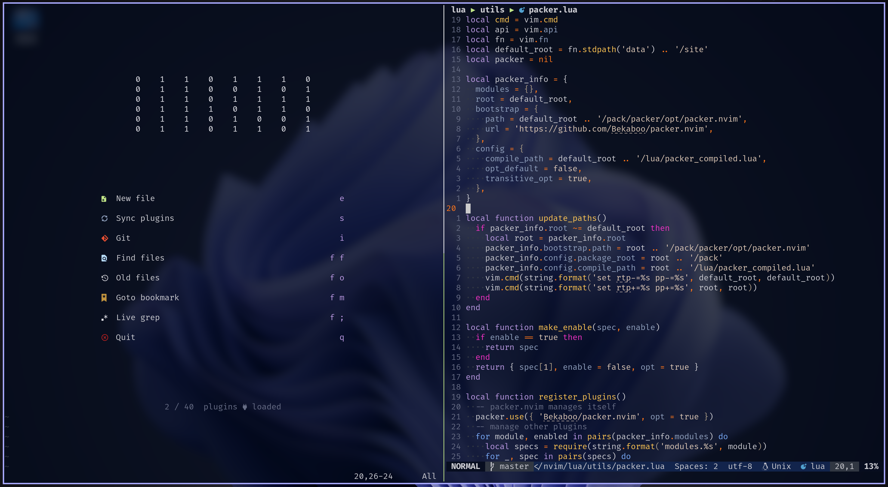

<h1 align="center"> Bekaboo's Neovim Configuration </h1>

<center>


</center>

## Table of Contents

1. [Features](#features)
2. [Requirements](#requirements)
3. [Installation](#installation)
4. [Overview](#overview)
    1. [Config Structure](#config-structure)
    2. [Boot Process](#boot-process)
5. [Tweaking this Configuration](#tweaking-this-configuration)
    1. [Managing Plugins with Modules](#managing-plugins-with-modules)
    2. [Installing Packages to an Existing Module](#installing-packages-to-an-existing-module)
    3. [Installing Packages to a New Module](#installing-packages-to-a-new-module)
    4. [General Settings and Options](#general-settings-and-options)
    5. [Keymaps](#keymaps)
    6. [Colorscheme](#colorscheme)
    7. [Auto Commands](#auto-commands)
    8. [LSP Server Configurations](#lsp-server-configuration)
    9. [Snippets](#snippets)
    10. [Enabling VSCode Integration](#enabling-vscode-integration)
6. [Appendix](#appendix)
    1. [Default Modules and Plugins of Choice](#default-modules-and-plugins-of-choice)
    2. [Startuptime Statistics](#startuptime-statistics)

## Features

- Modular Design
    - Install and manage packages in groups
    - Make it easy to use different set of configuration for different use cases
- [VSCode-Neovim](https://github.com/vscode-neovim/vscode-neovim) Integration
    - Feels at home in VSCode when you occasionally need it
- Fast Startup
    - Around [15 ~ 35 ms](#startuptime-statistics)

## Requirements

- [Neovim](https://github.com/neovim/neovim) (***nightly***)
- [Neovim Remote](https://github.com/mhinz/neovim-remote) and [Ranger](https://github.com/ranger/ranger) for file manager support
- [Fd](https://github.com/sharkdp/fd) and [Ripgrep](https://github.com/BurntSushi/ripgrep) for the fuzzy finder `telescope`
- [Git](https://git-scm.com/), of course
- A decent terminal emulator, [Kitty](https://sw.kovidgoyal.net/kitty/) for example
- A nerd font, I personally use [FiraCode](https://github.com/ryanoasis/nerd-fonts/tree/master/patched-fonts/FiraCode)

For LSP support:

- [Nodejs](https://nodejs.org/en/), for LSP support
- Clangd requires Zip (**not** Gzip) to be installed
- Some other LSP clients may requires Go, Cargo, etc.

Optional:

- [Lazygit](https://github.com/jesseduffield/lazygit) for improved git integration
- [Pandoc](https://pandoc.org/), [custom scripts](https://github.com/Bekaboo/dot/tree/master/.scripts) and [TexLive](https://www.tug.org/texlive/) (for ArchLinux users, it is `texlive-core` and `texlive-extra`) for markdown → PDF conversion

## Installation

1. Backup your own settings.
2. Make sure you have satisfied the requirements.
3. Clone this repo to your config directory
    ```
    git clone https://github.com/Bekaboo/nvim ~/.config/nvim
    ```
4. Open neovim, manually run `:PackerSync` if packer does not
    automatically sync.
5. Run `:checkhealth` to check potential dependency issues.
6. Enjoy!

## Overview

### Config Structure

```
.
├── colors                      # colorschemes loaders
├── plugin                      # custom plugins
├── ftplugin                    # custom filetype plugins
├── init.lua                    # entry of config
├── lua
│   ├── colors                  # the actual implementation of colorshemes
│   ├── init                    # files under this folder is required by 'init.lua'
│   │   ├── autocmds.lua
│   │   ├── general.lua         # options and general settings
│   │   ├── keymaps.lua
│   │   └── plugins.lua         # specify which modules to use in different conditions
│   ├── modules                 # all plugin specifications and configs go here
│   │   ├── base                # module 'base'
│   │   │   ├── configs.lua     # plugin configs
│   │   │   └── init.lua        # plugin specifications
│   │   ├── completion          # module 'completion'
│   │   ├── lsp                 # module 'lsp'
│   │   ├── markup              # ...
│   │   ├── misc
│   │   ├── tools
│   │   ├── treesitter
│   │   └── ui
│   ├── plugin                  # the actual implementation of custom plugins
│   └── utils
├── snapshots                   # packer snapshots go here
└── syntax                      # syntax files
```

### Boot Process

To optimize startup time, nearly all packages are lazy-loaded,
including `packer.nvim`.

```
┌──────────┐
│ init.lua │
└────┬─────┘┌──────────────────────┐
     ├─────►│ lua/init/general.lua │
     │      └──────────────────────┘
     │      ┌──────────────────────┐
     ├─────►│ lua/init/keymaps.lua │
     │      └──────────────────────┘
     │      ┌───────────────────────┐
     ├─────►│ lua/init/autocmds.lua │
     │      └───────────────────────┘
     │      ┌──────────────────────┐
     └─────►│ lua/init/plugins.lua │
            └──────────┬───────────┘
                       │
             specify modules to use
                       │     ┌──────────────────────┐
                       └────►│ lua/utils/packer.lua │
                             └──────────┬───────────┘
                                        │
                               check if packer.nvim
                                   is installed
                                        │
    install and load packer.nvim ◄─ NO ─┴─ YES ─► check if packer_compiled.lua exists
                     │                                         │
                     ▼                                         │        ┌─────────────────────┐
              register plugins ◄───────────── NO ──────────────┴─ YES ─►│ packer_compiled.lua │
                from modules                                            └─────────────────────┘
                     │  ┌──────────────────┐
                     ├─►│ lua/modules/base │
┌─────────────────┐  │  └──────────────────┘
│ lua/modules/lsp │◄─┤
└─────────────────┘  │  ┌────────────────────────┐
                     ├─►│ lua/modules/treesitter │
                     │  └────────────────────────┘
               ... ◄─┤
                     │
                     ▼
                sync plugins
```

## Tweaking this Configuration

### Managing Plugins with Modules

In order to enable or disable a module, one need to change the table in
[lua/init/plugins.lua](https://github.com/Bekaboo/nvim/blob/master/lua/init/plugins.lua) passed to `manage_plugins()`, for example

```lua
local manage_plugins = require('utils.packer').manage_plugins
manage_plugins({
  modules = {
    -- ...
    'base',
    'completion',
    'lsp',
    -- ...
  },
})
```

you can also pass `root`, `bootstrap`, and `configs` to `manage_plugins()`:

```lua
manage_plugins({
  root = vim.fn.stdpath('data') .. '/foo',
  bootstrap = {
    url = 'https://github.com/wbthomason/packer.nvim',
  },
  configs = {
    display = {
      open_fn = function()
        return require('packer.util').float({ border = 'double' })
      end,
    },
  },
})
```

- `root`: root directory of the plugins
    - Normally setting `root` will automatically set `bootstrap.path` and
        `configs.compile_path` **UNLESS** you explicitly set these
        two options in the argument passed to `manage_plugins()`
- `bootstrap`: information for automatically installing `packer.nvim`
- `configs`: configuration passed to `packer.init()`, see [packer's doc](https://github.com/wbthomason/packer.nvim#custom-initialization)

<details>
  <summary><strong>Default argument passed to `manage_plugins()`:</strong></summary>

  ```lua
  local default_root = fn.stdpath('data') .. '/site'
  local packer_info = {
    modules = {},
    root = default_root,
    bootstrap = {
      path = default_root .. '/pack/packer/opt/packer.nvim',
      url = 'https://github.com/wbthomason/packer.nvim',
    },
    config = {
      compile_path = default_root .. '/lua/packer_compiled.lua',
      opt_default = false,
      transitive_opt = true,
    },
  }
  ```

</details>

### Installing Packages to an Existing Module

To install plugin `foo` under module `misc`, just insert the
corresponding specification to the big table
`lua/modules/misc/init.lua` returns, for instance,

`lua/modules/misc/init.lua`:

```lua
-- ...

M['foo'] = {
  'foo/foo',
  requires = 'foo_dep',
}

-- ...

return M
```

### Installing Packages to a New Module

To install plugin `foo` under module `bar`, one should first
create module `bar` under [lua/modules](https://github.com/Bekaboo/nvim/tree/master/lua/modules), there are two approaches:

```
.
└── lua
    └── modules
        └── bar
            └── init.lua
```

or

```
.
└── lua
    └── modules
        └── bar.lua
```

in either case a module should return a big table containing
all specifications of plugins under that module, for instance:

```lua
{
  {
    'goolord/alpha-nvim',
    cond = function()
      return vim.fn.argc() == 0 and
          vim.o.lines >= 36 and vim.o.columns >= 80
    end,
    requires = 'nvim-web-devicons',
  }, {
    'romgrk/barbar.nvim',
    requries = 'nvim-web-devicons',
    config = function() require('bufferline').setup() end,
  },
}
```

After creating the new module `bar`, enable it in [lua/init/plugins.lua](hub.com/Bekaboo/nvim/blob/master/lua/init/plugins.lua):

```lua
local manage_plugins = require('utils.packer').manage_plugins

manage_plugins({
  modules = {
    -- ...
    'bar',
    -- ...
  }
})
```

### General Settings and Options

See [lua/init/general.lua](https://github.com/Bekaboo/nvim/blob/master/lua/init/general.lua).

### Keymaps

See [lua/init/keymaps.lua](https://github.com/Bekaboo/nvim/blob/master/lua/init/keymaps.lua), or see module config files for
corresponding plugin keymaps.

### Colorscheme



`nvim-falcon` is a builtin custom colorscheme optimized for transparent
background and is enabled by default.

To disable it, remove the [corresponding lines](https://github.com/Bekaboo/nvim/blob/master/lua/init/general.lua#L78-L80) in [lua/init/general.lua](https://github.com/Bekaboo/nvim/blob/master/lua/init/general.lua).

To tweak this colorscheme, see [lua/colors/nvim-falcon](https://github.com/Bekaboo/nvim/tree/master/lua/colors/nvim-falcon).

### Auto Commands

See [lua/init/autocmds.lua](https://github.com/Bekaboo/nvim/blob/master/lua/init/autocmds.lua).

### LSP Server Configurations

See [lua/modules/lsp/lsp-server-configs](https://github.com/Bekaboo/nvim/tree/master/lua/modules/lsp/lsp-server-configs).

### Snippets

This configuration use [LuaSnip](https://github.com/L3MON4D3/LuaSnip) as the snippet engine,
custom snippets for different filetypes
are defined under [lua/modules/completion/snippets](https://github.com/Bekaboo/nvim/tree/master/lua/modules/completion/snippets).

### Enabling VSCode Integration

VSCode integration takes advantages of the modular design, allowing to use
a different set of modules when Neovim is launched by VSCode, relevant code is
in [plugin/vscode_neovim.vim](https://github.com/Bekaboo/nvim/blob/master/plugin/vscode_neovim.vim) and [lua/init/plugins.lua](https://github.com/Bekaboo/nvim/blob/master/lua/init/plugins.lua).

To make VSCode integration work, please install [VSCode-Neovim](https://github.com/vscode-neovim/vscode-neovim) in VSCode
and configure it correctly.

After setting up VSCode-Neovim, re-enter VSCode, open a random file
and run `:PackerSync`, if the message says "Packer Compiled Successfully!" then
it should work.

<center>


</center>

## Appendix

### Default Modules and Plugins of Choice

Total # of plugins: 46 (package manager excluded).

- **Base**
    - [plenary.nvim](https://github.com/nvim-lua/plenary.nvim)
    - [nvim-web-devicons](https://github.com/kyazdani42/nvim-web-devicons)
- **Completion**
    - [nvim-cmp](https://github.com/hrsh7th/nvim-cmp)
    - [cmp-calc](https://github.com/hrsh7th/cmp-calc)
    - [cmp-cmdline](https://github.com/hrsh7th/cmp-cmdline)
    - [cmp-nvim-lsp](https://github.com/hrsh7th/cmp-nvim-lsp)
    - [cmp-path](https://github.com/hrsh7th/cmp-path)
    - [cmp-buffer](https://github.com/hrsh7th/cmp-buffer)
    - [cmp_luasnip](https://github.com/saadparwaiz1/cmp_luasnip)
    - [cmp-nvim-lsp-signature-help](https://github.com/hrsh7th/cmp-nvim-lsp-signature-help)
    - [copilot.lua](https://github.com/zbirenbaum/copilot.lua)
    - [LuaSnip](https://github.com/L3MON4D3/LuaSnip)
- **LSP**
    - [nvim-lspconfig](https://github.com/neovim/nvim-lspconfig)
    - [mason-lspconfig.nvim](https://github.com/williamboman/mason-lspconfig.nvim)
    - [aerial.nvim](https://github.com/stevearc/aerial.nvim)
    - [nvim-navic](https://github.com/SmiteshP/nvim-navic)
- **Markup**
    - [vimtex](https://github.com/lervag/vimtex)
    - [vim-markdown](https://github.com/preservim/vim-markdown)
    - [clipboard-image.nvim](https://github.com/ekickx/clipboard-image.nvim)
    - [markdown-preview.nvim](https://github.com/iamcco/markdown-preview.nvim)
- **Misc**
    - [nvim-surround](https://github.com/kylechui/nvim-surround)
    - [Comment.nvim](https://github.com/numToStr/Comment.nvim)
    - [vim-sleuth](https://github.com/tpope/vim-sleuth)
    - [nvim-autopairs](https://github.com/windwp/nvim-autopairs)
- **Tools**
    - [mason.nvim](https://github.com/williamboman/mason.nvim)
    - [telescope.nvim](https://github.com/nvim-telescope/telescope.nvim)
    - [telescope-fzf-native.nvim](https://github.com/nvim-telescope/telescope-fzf-native.nvim)
    - [undotree](https://github.com/mbbill/undotree)
    - [vim-floaterm](https://github.com/voldikss/vim-floaterm)
    - [gitsigns.nvim](https://github.com/lewis6991/gitsigns.nvim)
    - [rnvimr](https://github.com/kevinhwang91/rnvimr)
    - [tmux.nvim](https://github.com/aserowy/tmux.nvim)
- **Treesitter**
    - [nvim-treesitter](https://github.com/nvim-treesitter/nvim-treesitter)
    - [nvim-ts-rainbow](https://github.com/mrjones2014/nvim-ts-rainbow)
    - [nvim-treesitter-textobjects](https://github.com/nvim-treesitter/nvim-treesitter-textobjects)
    - [nvim-ts-context-commentstring](https://github.com/JoosepAlviste/nvim-ts-context-commentstring)
- **UI**
      - [barbar.nvim](https://github.com/romgrk/barbar.nvim)
      - [lualine.nvim](https://github.com/nvim-lualine/lualine.nvim)
      - [alpha-nvim](https://github.com/goolord/alpha-nvim)
- **DEBUG**
      - [nvim-dap](https://github.com/mfussenegger/nvim-dap)
      - [nvim-dap-ui](https://github.com/rcarriga/nvim-dap-ui)
      - [mason-nvim-dap.nvim](https://github.com/jayp0521/mason-nvim-dap.nvim)

### Startuptime Statistics

Last update: 2023-01-16

Neovim Version: `NVIM v0.9.0-dev-646+gef67503320`

Commit: `db72f37` (#551)

System: Arch Linux 6.1.4

Machine: Dell XPS-13-7390

Command: `nvim --startuptime startuptime.log`

<details>
  <summary>startuptime log</summary>

  ```
    times in msec
     clock   self+sourced   self:  sourced script
     clock   elapsed:              other lines

    000.007  000.007: --- NVIM STARTING ---
    000.054  000.047: event init
    000.102  000.048: early init
    000.137  000.035: locale set
    000.167  000.031: init first window
    000.373  000.205: inits 1
    000.381  000.009: window checked
    000.383  000.002: parsing arguments
    000.741  000.060  000.060: require('vim.shared')
    000.835  000.032  000.032: require('vim._meta')
    000.837  000.092  000.060: require('vim._editor')
    000.838  000.176  000.024: require('vim._init_packages')
    000.839  000.280: init lua interpreter
    000.880  000.041: expanding arguments
    000.904  000.024: inits 2
    001.109  000.205: init highlight
    001.110  000.001: waiting for UI
    001.208  000.098: done waiting for UI
    001.213  000.005: clear screen
    001.305  000.092: init default mappings
    001.316  000.011: init default autocommands
    001.653  000.061  000.061: sourcing /usr/share/nvim/runtime/ftplugin.vim
    001.702  000.022  000.022: sourcing /usr/share/nvim/runtime/indent.vim
    001.741  000.007  000.007: sourcing /usr/share/nvim/archlinux.vim
    001.744  000.021  000.014: sourcing /etc/xdg/nvim/sysinit.vim
    003.039  000.032  000.032: require('colors.nvim-falcon.palette')
    003.146  000.523  000.491: require('colors.nvim-falcon.colorscheme')
    003.148  000.559  000.036: require('colors.nvim-falcon')
    003.952  000.073  000.073: require('colors.nvim-falcon.terminal')
    003.956  001.377  000.746: sourcing /home/zeng/.config/nvim/colors/nvim-falcon.lua
    003.960  002.190  000.813: require('init.general')
    004.077  000.005  000.005: require('vim.keymap')
    004.879  000.918  000.913: require('init.keymaps')
    004.954  000.072  000.072: require('init.autocmds')
    005.194  000.202  000.202: require('utils.packer')
    006.651  000.398  000.398: require('packer.load')
    007.549  000.006  000.006: require('vim.F')
    007.559  000.696  000.690: require('alpha')
    007.691  000.131  000.131: require('alpha.themes.dashboard')
    008.047  000.354  000.354: require('utils.static')
    008.710  000.044  000.044: sourcing /home/zeng/.local/share/nvim/site/pack/packer/opt/vim-markdown/ftdetect/markdown.vim
    008.743  000.015  000.015: sourcing /home/zeng/.local/share/nvim/site/pack/packer/opt/vimtex/ftdetect/cls.vim
    008.775  000.016  000.016: sourcing /home/zeng/.local/share/nvim/site/pack/packer/opt/vimtex/ftdetect/tex.vim
    008.805  000.014  000.014: sourcing /home/zeng/.local/share/nvim/site/pack/packer/opt/vimtex/ftdetect/tikz.vim
    008.825  003.603  001.936: require('packer_compiled')
    008.852  003.896  000.091: require('init.plugins')
    008.853  007.095  000.020: sourcing /home/zeng/.config/nvim/init.lua
    008.858  000.342: sourcing vimrc file(s)
    009.054  000.009  000.009: sourcing /usr/share/vim/vimfiles/ftdetect/PKGBUILD.vim
    009.074  000.009  000.009: sourcing /usr/share/vim/vimfiles/ftdetect/SRCINFO.vim
    009.131  000.232  000.214: sourcing /usr/share/nvim/runtime/filetype.lua
    009.273  000.072  000.072: sourcing /usr/share/nvim/runtime/syntax/synload.vim
    009.345  000.182  000.110: sourcing /usr/share/nvim/runtime/syntax/syntax.vim
    009.585  000.009  000.009: sourcing /home/zeng/.config/nvim/plugin/vscode_neovim.vim
    009.783  000.010  000.010: sourcing /usr/share/nvim/runtime/plugin/gzip.vim
    009.800  000.007  000.007: sourcing /usr/share/nvim/runtime/plugin/health.vim
    009.816  000.008  000.008: sourcing /usr/share/nvim/runtime/plugin/matchit.vim
    009.936  000.110  000.110: sourcing /usr/share/nvim/runtime/plugin/matchparen.vim
    009.961  000.012  000.012: sourcing /usr/share/nvim/runtime/plugin/netrwPlugin.vim
    010.073  000.006  000.006: sourcing /home/zeng/.local/share/nvim/rplugin.vim
    010.080  000.108  000.102: sourcing /usr/share/nvim/runtime/plugin/rplugin.vim
    010.135  000.046  000.046: sourcing /usr/share/nvim/runtime/plugin/shada.vim
    010.168  000.016  000.016: sourcing /usr/share/nvim/runtime/plugin/spellfile.vim
    010.192  000.011  000.011: sourcing /usr/share/nvim/runtime/plugin/tarPlugin.vim
    010.210  000.007  000.007: sourcing /usr/share/nvim/runtime/plugin/tohtml.vim
    010.233  000.012  000.012: sourcing /usr/share/nvim/runtime/plugin/tutor.vim
    010.294  000.013  000.013: sourcing /usr/share/nvim/runtime/plugin/zipPlugin.vim
    010.500  000.118  000.118: sourcing /home/zeng/.config/nvim/plugin/auto_hlsearch.lua
    010.555  000.038  000.038: sourcing /home/zeng/.config/nvim/plugin/auto_set_spell.lua
    010.600  000.033  000.033: sourcing /home/zeng/.config/nvim/plugin/tabout.lua
    010.811  000.039  000.039: sourcing /usr/share/nvim/runtime/plugin/editorconfig.lua
    010.879  000.056  000.056: sourcing /usr/share/nvim/runtime/plugin/man.lua
    010.912  000.019  000.019: sourcing /usr/share/nvim/runtime/plugin/nvim.lua
    010.927  000.981: loading rtp plugins
    011.048  000.120: loading packages
    011.489  000.121  000.121: sourcing /home/zeng/.local/share/nvim/site/pack/packer/start/rnvimr/after/plugin/rnvimr.vim
    011.527  000.359: loading after plugins
    011.541  000.014: inits 3
    013.598  002.057: reading ShaDa
    013.783  000.185: opening buffers
    013.914  000.116  000.116: require('utils.funcs')
    014.107  000.113  000.113: sourcing /home/zeng/.local/share/nvim/site/pack/packer/start/rnvimr/autoload/rnvimr.vim
    014.128  000.116: BufEnter autocommands
    014.130  000.002: editing files in windows
    015.761  001.631: VimEnter autocommands
    015.764  000.004: UIEnter autocommands
    015.766  000.002: before starting main loop
    016.512  000.746: first screen update
    016.515  000.002: --- NVIM STARTED ---
  ```

</details>

<details>
  <summary>statistics of 50 startups (sorted)</summary>


  ```
  016.891  000.004: --- NVIM STARTED ---
  018.252  000.003: --- NVIM STARTED ---
  019.379  000.003: --- NVIM STARTED ---
  019.416  000.003: --- NVIM STARTED ---
  019.486  000.003: --- NVIM STARTED ---
  019.490  000.003: --- NVIM STARTED ---
  019.644  000.004: --- NVIM STARTED ---
  019.657  000.003: --- NVIM STARTED ---
  019.746  000.004: --- NVIM STARTED ---
  019.794  000.003: --- NVIM STARTED ---
  019.821  000.003: --- NVIM STARTED ---
  019.846  000.003: --- NVIM STARTED ---
  019.913  000.003: --- NVIM STARTED ---
  019.951  000.003: --- NVIM STARTED ---
  019.961  000.003: --- NVIM STARTED ---
  019.969  000.003: --- NVIM STARTED ---
  019.985  000.003: --- NVIM STARTED ---
  020.053  000.003: --- NVIM STARTED ---
  020.107  000.003: --- NVIM STARTED ---
  020.118  000.003: --- NVIM STARTED ---
  020.133  000.003: --- NVIM STARTED ---
  020.134  000.003: --- NVIM STARTED ---
  020.136  000.003: --- NVIM STARTED ---
  020.202  000.003: --- NVIM STARTED ---
  020.229  000.003: --- NVIM STARTED ---
  020.236  000.003: --- NVIM STARTED ---
  020.236  000.003: --- NVIM STARTED ---
  020.248  000.003: --- NVIM STARTED ---
  020.327  000.003: --- NVIM STARTED ---
  020.346  000.003: --- NVIM STARTED ---
  020.374  000.003: --- NVIM STARTED ---
  020.379  000.003: --- NVIM STARTED ---
  020.401  000.003: --- NVIM STARTED ---
  020.440  000.003: --- NVIM STARTED ---
  020.486  000.003: --- NVIM STARTED ---
  020.509  000.003: --- NVIM STARTED ---
  020.524  000.003: --- NVIM STARTED ---
  020.543  000.003: --- NVIM STARTED ---
  020.555  000.003: --- NVIM STARTED ---
  020.570  000.003: --- NVIM STARTED ---
  020.584  000.003: --- NVIM STARTED ---
  020.635  000.003: --- NVIM STARTED ---
  020.717  000.003: --- NVIM STARTED ---
  020.736  000.003: --- NVIM STARTED ---
  020.763  000.003: --- NVIM STARTED ---
  021.218  000.003: --- NVIM STARTED ---
  021.375  000.003: --- NVIM STARTED ---
  021.800  000.003: --- NVIM STARTED ---
  026.470  000.004: --- NVIM STARTED ---
  027.071  000.004: --- NVIM STARTED ---
  ```

</details>
